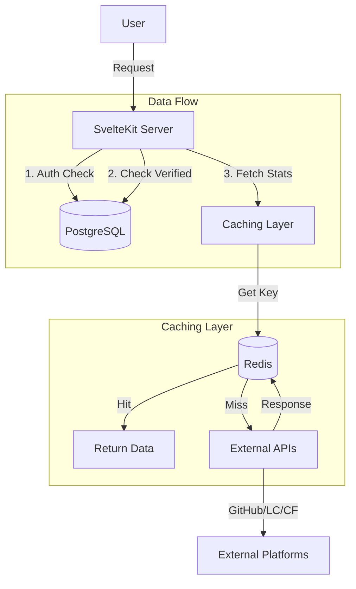

# System Architecture

## Overview

DevCompass follows a **server-side rendered (SSR)** architecture using SvelteKit. It leverages a clean separation between the frontend UI, server-side actions, caching layer, and persistent storage.

---

## Core Components

### 1. Web Layer (SvelteKit)

- **Routes**:
  - `/dashboard`: Main analytics view (auto-fetches verified data).
  - `/verify`: Account verification interface.
  - `/profile`: Public profile view.
- **Server Actions**: Handle form submissions for verification and settings updates.
- **Load Functions**: Fetch data on the server before rendering the UI to ensure fast First Contentful Paint (FCP).

### 2. Authentication Layer (BetterAuth)

- Manages user sessions and OAuth flows (GitHub & Google).
- Stores session data in PostgreSQL (`user`, `session`, `account` tables).
- Provides `locals.user` to server-side load functions for protected routes.

### 3. Verification & Synchronization Module

Located in `$lib/server/verification/` and `$lib/server/recommendations/`.

- **Purpose**: Proves ownership of external accounts and synchronizes problem history.
- **Strategy**: Platform-specific verifiers (Bio token, OAuth, Name match).
- **Synchronization**: LeetCode uses a bulk import process to backfill history, enabling personalized recommendations.
- **Storage**: Verified handles and sync status are stored in the `platform_handles` table.

### 4. Caching & Data Layer

- **Redis (Upstash)**: Caches expensive 3rd-party API responses.
- **PostgreSQL**: Source of truth for User data, Verified Handles, and Application State.
- **Drizzle ORM**: Type-safe database interactions.

---

## System Flow Diagram

## Key Considerations

### Scalability

- **Stateless Server**: All state is in DB/Redis.
- **Caching**: Aggressive caching (TTL 2-6h) prevents rate limiting from external APIs.
- **Parallel Fetching**: Dashboard fetches multiple platform stats concurrently using `Promise.all`.

### Security

- **OAuth**: No password storage for GitHub login.
- **Environment**: Sensitive keys (`GITHUB_CLIENT_SECRET`, `UPSTASH_TOKEN`) are server-side only.
- **Verification**: Strict ownership checks prevent claiming others' profiles.
