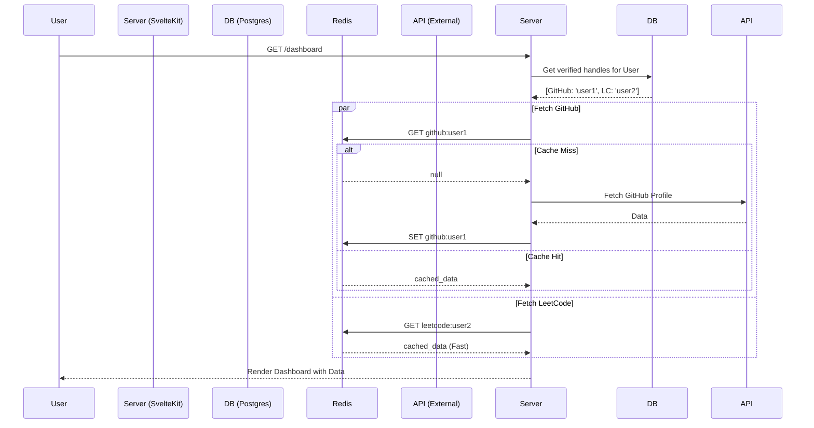

# Dashboard Data Flow

## Overview

The Dashboard (`/dashboard`) is the central hub of DevCompass. It automatically aggregates data from all **verified** platforms without requiring manual input from the user.

---

## 1. Data Loading (`load` function)

The `load` function in `src/routes/dashboard/+page.server.ts` orchestrates the fetching process.

### Step 1: Authentication

- Check `locals.user`. If missing, redirect to login.

### Step 2: Fetch Verified Accounts

- Query `platform_handles` table.
- Filter for `verifiedAt IS NOT NULL`.
- **Result**: List of platforms and handles (e.g., `[{ platform: 'github', handle: 'toxduck' }]`).

### Step 3: Parallel Data Fetching

- Map over the verified accounts list.
- Call the **Cached API Function** for each platform (`getGithubStatsCached`, etc.).
- Use `Promise.all` to fetch all data concurrently.
- **Fail Safety**: If one platform API fails, it returns `null` for that platform but does _not_ crash the entire dashboard.

### Step 4: Return Data

- Filter out failed requests.
- Return structured array `[ { platform: 'github', data: ... }, ... ]`.

---

## 2. UI Rendering (`+page.svelte`)

The frontend receives the pre-fetched data and renders it immediately.

- **Auto-Selection**: The first verified platform in the list is automatically selected and displayed.
- **Tabs**: Platform tabs are dynamically generated based on verified accounts.
- **Components**: Each platform has a dedicated dashboard component (e.g., `<GithubDashboard />`) that handles the specific visualization of that data.

---

## 3. Manual Fallback

If a user has **no verified accounts**, the dashboard:

1. Shows a "Connect Accounts" prompt.
2. Displays the manual lookup form (allowing searching for any user).
3. Useful for looking up friends or competitors without verifying.

---

## Orchestration Diagram

